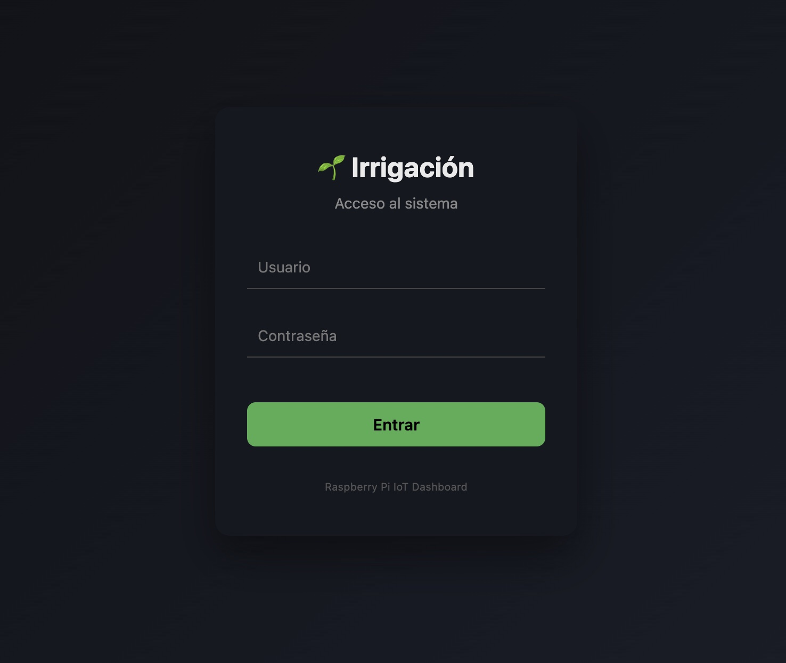

🌱 Irrigación

ESP32 + Sensores ──LoRa──► Raspberry Pi ──► SQLite ──► Dashboard

### Irrigación es un sistema IoT para el control inteligente de riego basado en Raspberry Pi, con interfaz web moderna y arquitectura modular orientada a producción.

El sistema permite monitorizar sensores, programar riegos, registrar eventos y visualizar datos en tiempo real, con foco en escalabilidad y futuras integraciones.

🚀 Funcionalidades actuales

📊 Dashboard web con login seguro

🌡️ Lectura y almacenamiento de:

Temperatura

Humedad ambiental

⏱️ Scheduler interno basado en la hora del sistema (RPi)

💧 Control de riego mediante relé (válvula solenoide)

🗄️ Base de datos SQLite:

Histórico de sensores

Registros de riego

🔐 Autenticación de usuarios (Flask-Login + hash de contraseñas)

🧱 Arquitectura desacoplada:

Web

Scheduler

Hardware

🧩 Funcionalidades en desarrollo / previstas

🚿 Contador de riego (tiempo y volumen)

📈 Consumo de agua

🧪 Gestión de fertilización

📆 Programador avanzado de riego

📡 Integración ESP32 + LoRa para sensores remotos

📊 Gráficas históricas avanzadas

👥 Roles de usuario (admin / viewer)

🛠️ Tecnologías

Python 3

Flask

Flask-Login

SQLite

HTML / CSS / JS

Raspberry Pi Zero

DHT11

Relés electrovalvulas

🎯 Objetivo del proyecto.

Crear un sistema de riego inteligente, robusto y extensible, válido tanto para uso doméstico como para evolución hacia entornos agrícolas distribuidos mediante ESP32 + LoRa.

            ┌──────────────┐
            │   Usuario    │
            │   (Browser)  │
            └──────┬───────┘
                   │ HTTP
                   ▼
        ┌─────────────────────┐
        │     Flask Web App    │
        │  (Routes / Auth)    │
        └──────┬──────────────┘
               │ SQL (read)
               ▼
        ┌─────────────────────┐
        │      SQLite DB      │
        │  sensor_data        │
        │  irrigation_log     │
        │  users              │
        └──────▲──────────────┘
               │ SQL (write)
        ┌──────┴──────────────┐
        │   Scheduler Thread  │
        │ (background worker)│
        └──────┬──────────────┘
               │ GPIO
               ▼
     ┌───────────────────────┐
     │ Hardware (RPi Zero)   │
     │ - DHT11               │
     │ - Relé / Válvula      │
     └───────────────────────┘

sudo systemctl start irrigation
sudo systemctl stop irrigation
sudo systemctl restart irrigation
sudo systemctl status irrigation