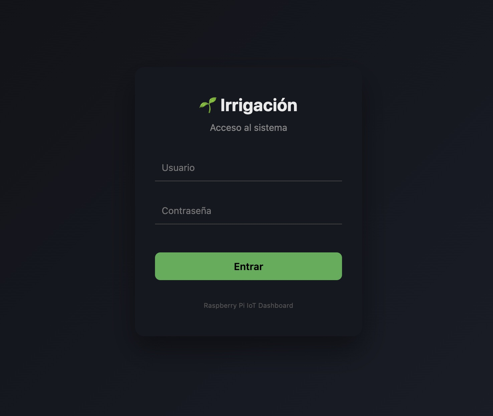

🌱 Irrigación


ESP32 + Sensores ──LoRa──► Raspberry Pi ──► SQLite ──► Dashboard

### Irrigación es un sistema IoT para el control inteligente de riego basado en Raspberry Pi, con interfaz web moderna y arquitectura modular orientada a producción.

El sistema permite monitorizar sensores, programar riegos, registrar eventos y visualizar datos en tiempo real, con foco en escalabilidad y futuras integraciones.

🚀 Funcionalidades actuales

📊 Dashboard web con login seguro

🌡️ Lectura y almacenamiento de:

Temperatura

Humedad ambiental

⏱️ Scheduler interno basado en la hora del sistema (RPi)

💧 Control de riego mediante relé (válvula solenoide)

🗄️ Base de datos SQLite:

Histórico de sensores

Registros de riego

🔐 Autenticación de usuarios (Flask-Login + hash de contraseñas)

🧱 Arquitectura desacoplada:

Web

Scheduler

Hardware

🧩 Funcionalidades en desarrollo / previstas

🚿 Contador de riego (tiempo y volumen)

📈 Consumo de agua

🧪 Gestión de fertilización

📆 Programador avanzado de riego

✅ Integración ESP32 + LoRa para control remoto de válvulas (IMPLEMENTADO - ver ESP32/)

📊 Gráficas históricas avanzadas

👥 Roles de usuario (admin / viewer)

🛠️ Tecnologías

Python 3

Flask

Flask-Login

SQLite

HTML / CSS / JS

Raspberry Pi Zero

DHT11

Relés electrovalvulas


🎯 Objetivo del proyecto.

Crear un sistema de riego inteligente, robusto y extensible, válido tanto para uso doméstico como para evolución hacia entornos agrícolas distribuidos mediante ESP32 + LoRa.


            ┌──────────────┐
            │   Usuario    │
            │   (Browser)  │
            └──────┬───────┘
                   │ HTTP
                   ▼
        ┌─────────────────────┐
        │     Flask Web App    │
        │  (Routes / Auth)    │
        └──────┬──────────────┘
               │ SQL (read)
               ▼
        ┌─────────────────────┐
        │      SQLite DB      │
        │  sensor_data        │
        │  irrigation_log     │
        │  users              │
        └──────▲──────────────┘
               │ SQL (write)
        ┌──────┴──────────────┐
        │   Scheduler Thread  │
        │ (background worker)│
        └──────┬──────────────┘
               │ 
               ▼
     ┌───────────────────────┐
     │ Hardware Layer        │
     │ - GPIO (local)        │
     │ - LoRa (remote ESP32) │◄─── LoRa Radio (up to 2km)
     └───────┬───────────────┘
             │
             ▼
  ┌──────────────────────────┐
  │ Local: RPi GPIO          │
  │ - DHT11 Sensor           │
  │ - Relé (3 zones)         │
  └──────────────────────────┘
             
             OR
             
  ┌──────────────────────────┐
  │ Remote: ESP32 + LoRa     │
  │ - 4-CH Relay Module      │
  │ - 4 Solenoid Valves      │
  │ - Auto-shutoff Timers    │
  └──────────────────────────┘

## 📡 ESP32 LoRa Control (NEW!)

Control 4 solenoid valves wirelessly with ESP32 via LoRa (up to 2km range).

**Quick Start:** See `ESP32_QUICKSTART.md`

**Complete Guide:** See `ESP32/SETUP_GUIDE.md`

**Features:**
- ✅ Long-range wireless control (up to 2km)
- ✅ 4 irrigation zones
- ✅ Auto-shutoff timers
- ✅ Signal quality monitoring
- ✅ Emergency stop
- ✅ Compatible with existing web interface

## 🚀 Getting Started

### Option 1: Local GPIO Control (Original)
```bash
# Configure for direct GPIO control
# Edit app/config.py: HARDWARE_MODE = 'GPIO'
python run.py
```

### Option 2: ESP32 LoRa Control (NEW!)
```bash
# 1. Setup ESP32 hardware (see ESP32/SETUP_GUIDE.md)
# 2. Configure for LoRa mode
# Edit app/config.py: HARDWARE_MODE = 'LORA'
# 3. Test connection
python3 scripts/test_lora.py
# 4. Start application
python run.py
```

sudo systemctl start irrigation
sudo systemctl stop irrigation
sudo systemctl restart irrigation
sudo systemctl status irrigation